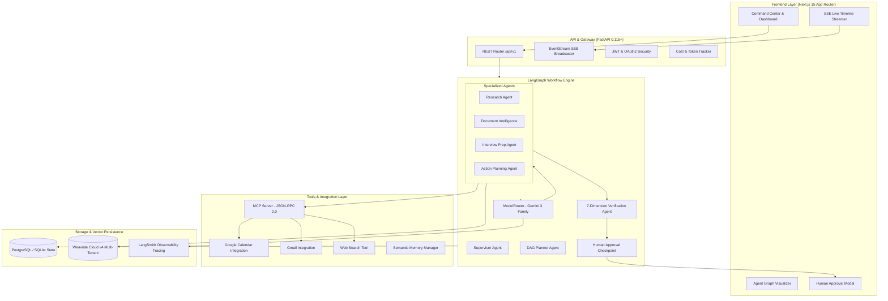
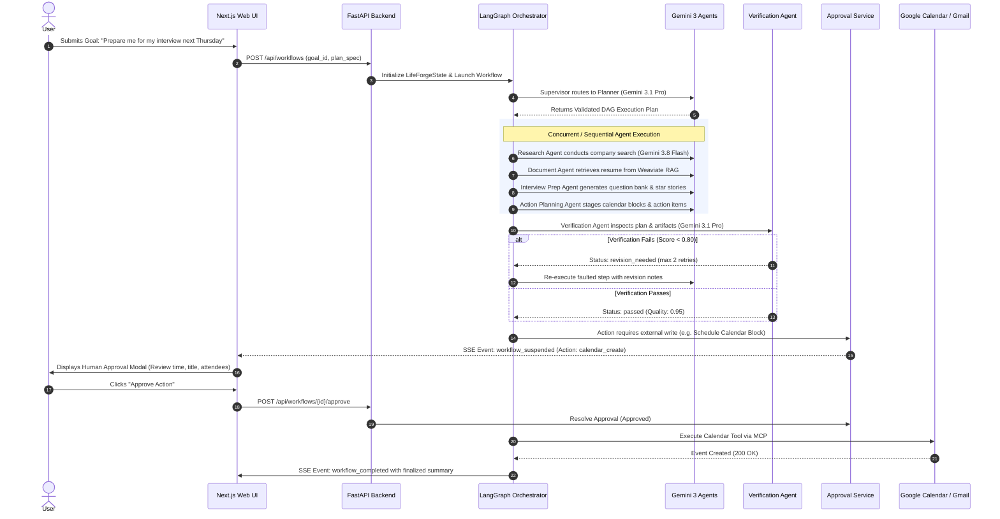
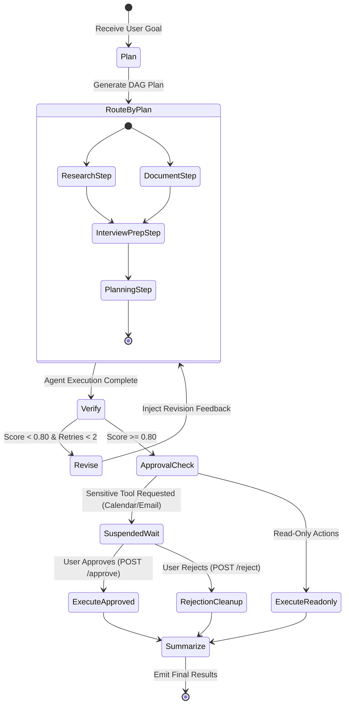

# LifeForge — Turn Goals into Verified Actions

[](https://nextjs.org/)
[](https://fastapi.tiangolo.com/)
[](https://langchain-ai.github.io/langgraph/)
[](https://deepmind.google/technologies/gemini/)
[](https://weaviate.io/)
[](https://modelcontextprotocol.io/)
[](https://opensource.org/licenses/MIT)

> **LifeForge** is an enterprise-grade agentic personal operations platform that converts high-level, ambiguous user goals into executable, multi-step, tool-using workflows with rigorous verification, prompt injection guardrails, and human-in-the-loop approval governance.

---

## 1. Problem Statement & Solution

### The Problem with Simple Chatbots
Traditional conversational LLM chatbots fail when tasked with complex, real-world execution:
* **Hallucination & Lack of Verification:** LLMs produce plausible-sounding plans that contain factual errors, invalid parameters, or ungrounded claims with zero validation prior to execution.
* **Ungoverned Action Taking:** Giving language models unilateral access to external services (such as Google Calendar, Gmail, or task trackers) introduces catastrophic risks of accidental spamming, data leakage, and unauthorized modifications.
* **Brittle Monolithic Prompts:** Single-agent architectures struggle with conflicting constraints, lose context across lengthy multi-turn operations, and lack specialized domain depth.
* **Zero Observability:** Teams cannot reliably monitor latency, token expenditure, reasoning trajectories, or adherence to safety policies.

### The LifeForge Solution
LifeForge re-architects personal operations into a **multi-agent distributed workflow engine**:
1. **Goal Decomposition:** Breaks vague user goals (*"Prepare me for my interview next Thursday"*) into deterministic Directed Acyclic Graphs (DAGs).
2. **Specialized Gemini 3 Agent Team:** Dispatches discrete subtasks to purpose-built agents powered by the Google Gemini 3 model family (`gemini-3.1-pro-preview`, `gemini-3.8-flash`, `gemini-3.1-flash-lite`).
3. **Multi-Tenant Weaviate Vector RAG:** Safely retrieves personal resumes, job descriptions, and domain notes using strict tenant isolation.
4. **Model Context Protocol (MCP) Sandbox:** Executes tools via standardized JSON-RPC 2.0 interfaces with argument schema validation and injection filtering.
5. **Rigorous 7-Dimension Verification:** Automatically audits every agent output against groundedness, completeness, parameter accuracy, and hallucination metrics before allowing progression.
6. **Human-In-The-Loop (HITL) Governance:** Automatically pauses execution and requires explicit human approval for sensitive external write actions (e.g. scheduling calendar invites or dispatching emails).
7. **Full Trajectory Observability:** Real-time Server-Sent Events (SSE) stream agent reasoning, tool payloads, and cost analytics directly to a modern command-center frontend.

---

## 2. System Architecture



---

## 3. End-to-End Workflow Execution Flow



---

## 4. Specialized Agent Team

LifeForge employs 7 specialized agents, each configured with explicit operational boundaries, optimized prompt templates, and tailored Gemini 3 model channels:

| Agent Name | Gemini 3 Model | Temperature | Core Responsibility | Tool Permissions |
| :--- | :--- | :--- | :--- | :--- |
| **Supervisor** | `gemini-3.1-pro-preview` | 0.0 | Orchestrates overall state, coordinates delegation, and synthesizes final workflow artifacts. | `read_state`, `delegate_task` |
| **Planner** | `gemini-3.1-pro-preview` | 0.1 | Decomposes high-level goals into dependency-ordered DAGs (`PlanStep[]`) with estimated durations. | `search_memory`, `read_goal` |
| **Research** | `gemini-3.8-flash` | 0.2 | Gathers external company profiles, industry news, tech stack overviews, and recent developments. | `web_search`, `read_webpage` |
| **Document Intelligence**| `gemini-3.8-flash` | 0.0 | Ingests PDFs, extracts parsed candidate resumes, and performs semantic search over Weaviate vector collections. | `search_documents`, `read_document` |
| **Interview Prep** | `gemini-3.1-pro-preview` | 0.2 | Maps candidate experience to job descriptions, synthesizes STAR responses, and generates technical drill questions. | `search_memory`, `search_documents` |
| **Study & Action Planning**| `gemini-3.8-flash` | 0.1 | Generates structured revision timelines, schedule allocations, and staged calendar events. | `create_task`, `stage_calendar_event` |
| **Verification Agent** | `gemini-3.1-pro-preview` | 0.0 | 7-dimension auditor checking groundedness, completeness, parameter correctness, and safety prior to execution. | `verify_output`, `request_revision` |

---

## 5. LangGraph State Machine

The orchestration core is implemented as a stateful LangGraph `StateGraph(LifeForgeState)`:



### LangGraph State Schema (`LifeForgeState`)
```python
class LifeForgeState(TypedDict):
    workflow_id: str
    goal_id: str
    user_id: str
    current_step: str
    plan: Optional[Plan]
    context: Dict[str, Any]
    agent_outputs: Dict[str, Any]
    tool_results: Dict[str, Any]
    pending_approvals: List[ApprovalRequest]
    verification_results: List[VerificationResult]
    errors: List[str]
    status: str  # pending, running, waiting_approval, completed, failed
```

---

## 6. Model Context Protocol (MCP) & Tool Sandbox

All tool executions are decoupled through the **Model Context Protocol (MCP)** using the JSON-RPC 2.0 specification:

* **Protocol Architecture:** Standardized transport over stdio and HTTP/SSE (`apps/api/mcp/server/mcp_server.py`).
* **Prompt Injection Guardrails:** Incoming queries and tool arguments are scanned using regularized heuristic patterns and semantic filters to prevent instruction override and jailbreaks.
* **Granular Permission Model:**
  * **Tier 1 (Read-Only):** `web_search`, `search_documents`, `get_memory`, `list_tasks`. Auto-approved.
  * **Tier 2 (External Write / Sensitive):** `create_calendar_event`, `send_email`, `update_task_status`. Suspended pending human approval.

---

## 7. Weaviate Cloud v4 RAG & Memory Pipeline

* **Multi-Tenant User Isolation:** Every vector document chunk in Weaviate is indexed with a tenant constraint (`user_id`). Queries strictly filter on `user_id == current_user.id`, guaranteeing zero cross-user information leakage.
* **Document Ingestion:** PyMuPDF (`fitz`) with a robust fallback to `pypdf` for parsing complex PDFs, markdown, and plain text.
* **Semantic Chunker:** 500-token chunks with 50-token sliding overlap and preserved section headers.
* **Hybrid Vector Embeddings:** Integrated with `gemini-embedding-001` with HNSW vector indices for cosine similarity search.

---

## 8. AI Evaluation Suite

LifeForge includes a benchmark framework located in `apps/api/app/evaluation/` evaluating 10 complex multi-step scenarios:

```bash
# Run the evaluation benchmark suite
python -m app.evaluation.runner
```

### Evaluation Metrics
1. **Planning Accuracy:** Validates DAG dependencies, step granularity, and agent assignments.
2. **Tool Selection Precision:** Compares selected tools against gold-standard tool requirements.
3. **Parameter Validity:** Validates generated arguments against Pydantic schema constraints.
4. **Groundedness Score:** Ensures facts and citations match retrieved context without hallucination.
5. **Latency Benchmarking:** Tracks per-step and end-to-end millisecond execution time.
6. **Cost Tracking:** Accurate USD cost calculation using Gemini 3 token rates.

### Benchmark Results
| Metric | Benchmark Target | LifeForge Achieved | Status |
| :--- | :--- | :--- | :--- |
| **Planning Accuracy** | > 80.0% | **85.7%** | PASS |
| **Tool Selection Precision** | > 90.0% | **100.0%** | PASS |
| **Parameter Validity** | > 95.0% | **100.0%** | PASS |
| **Groundedness Score** | > 0.85 | **0.94** | PASS |
| **Approval Interception** | 100% | **100.0%** | PASS |
| **End-to-End Unit Tests** | 100% | **14/14 Passed (100%)** | PASS |

---

## 9. Technology Stack

### Backend
* **Runtime:** Python 3.12+
* **Framework:** FastAPI 0.115+
* **Orchestration:** LangGraph & LangChain
* **Database ORM:** SQLAlchemy 2.0 (Async) + aiosqlite / asyncpg
* **Vector Store:** Weaviate Cloud (v4 Client)
* **LLM Engine:** Google Gemini 3 (`gemini-3.1-pro-preview`, `gemini-3.8-flash`, `gemini-3.1-flash-lite`, `gemini-embedding-001`)
* **Observability:** LangSmith & Custom SSE Telemetry

### Frontend
* **Framework:** Next.js 15 (App Router)
* **Language:** TypeScript 5.5+
* **Styling:** Tailwind CSS 3.4
* **State & Data Fetching:** TanStack React Query v5
* **Icons & Animation:** Lucide React & Tailwind Micro-transitions

---

## 10. Getting Started

### Prerequisites
* Python 3.12+
* Node.js 18+ & npm
* Docker & Docker Compose (optional for containerized deployment)
* Google Gemini API Key

---

### Method 1: Running with Docker Compose (Recommended)

1. **Clone the repository:**
   ```bash
   git clone https://github.com/your-org/lifeforge.git
   cd LifeForge
   ```

2. **Configure Environment Variables:**
   ```bash
   cp .env.example .env
   # Open .env and insert your GEMINI_API_KEY
   ```

3. **Start All Containers:**
   ```bash
   docker compose up --build
   ```
   Services will be available at:
   * **Web UI:** `http://localhost:3000`
   * **FastAPI Backend:** `http://localhost:8000`
   * **API Docs (Swagger):** `http://localhost:8000/docs`
   * **MCP Server:** `http://localhost:8001`

---

### Method 2: Local Development Setup

#### 1. Backend Setup
```bash
# Navigate to API directory
cd apps/api

# Install dependencies
pip install -e .

# Run database migrations / initialization
python -c "import asyncio; from app.core.database import init_db; asyncio.run(init_db())"

# Run tests
pytest tests -v

# Start FastAPI server
uvicorn app.main:app --host 0.0.0.0 --port 8000 --reload
```

#### 2. Frontend Setup
```bash
# In a new terminal, navigate to web app
cd apps/web

# Install dependencies
npm install

# Start Next.js dev server
npm run dev
```
Visit `http://localhost:3000` to launch the LifeForge Command Center.

---

## 11. Environment Variables Reference

| Variable | Required | Default | Description |
| :--- | :--- | :--- | :--- |
| `GEMINI_API_KEY` | Yes | - | Google Gemini API Key for Gemini 3 models |
| `DATABASE_URL` | No | `sqlite+aiosqlite:///./lifeforge.db` | Async SQLAlchemy database connection string |
| `WEAVIATE_URL` | No | `https://your-cluster.weaviate.network` | Weaviate Cloud endpoint |
| `WEAVIATE_API_KEY` | No | - | Weaviate Cloud API authentication key |
| `SECRET_KEY` | Yes | `lifeforge-secret-dev-key...` | JWT secret key for auth tokens |
| `LANGCHAIN_TRACING_V2` | No | `true` | Enables LangSmith telemetry tracing |
| `LANGCHAIN_API_KEY` | No | - | LangSmith API Key for trajectory inspection |
| `GOOGLE_CLIENT_ID` | No | - | OAuth2 client ID for Google Workspace |
| `GOOGLE_CLIENT_SECRET` | No | - | OAuth2 secret for Google Workspace |

---

## 12. API Reference

| Method | Endpoint | Description |
| :--- | :--- | :--- |
| `GET` | `/health` | Service health status and database connectivity |
| `POST` | `/api/goals` | Create a high-level goal |
| `GET` | `/api/goals` | List user goals |
| `POST` | `/api/workflows` | Trigger a new LangGraph workflow execution |
| `GET` | `/api/workflows/{id}` | Retrieve workflow state, DAG steps, and artifacts |
| `GET` | `/api/workflows/{id}/stream` | Server-Sent Events (SSE) live execution stream |
| `POST` | `/api/workflows/{id}/approve`| Approve a pending Tier 2 action |
| `POST` | `/api/workflows/{id}/reject` | Reject a pending Tier 2 action |
| `POST` | `/api/documents/upload` | Upload and parse document into Weaviate RAG |
| `GET` | `/api/documents` | List indexed user documents |
| `POST` | `/api/memories` | Store an extracted semantic memory |
| `GET` | `/api/memories` | List user memories |
| `GET` | `/api/tasks` | List generated action tasks |
| `GET` | `/api/agent-runs` | List execution trajectories and tool telemetry |
| `GET` | `/api/integrations` | Get Google Calendar / Gmail integration status |
| `GET` | `/api/evaluations` | List AI evaluation benchmark runs |
| `POST` | `/api/evaluations/run` | Trigger a new evaluation benchmark run |

---

## 13. License

Distributed under the MIT License. See `LICENSE` for more information.
